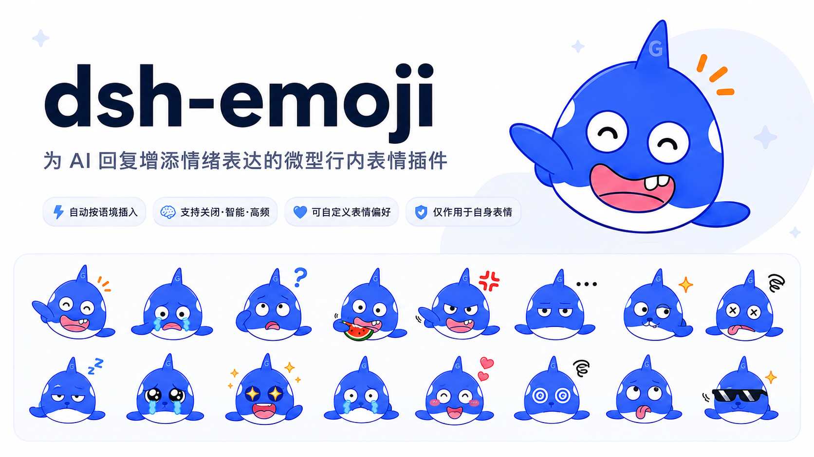

# dsh-emoji



`dsh-emoji` 是 DeepSeek Harness 的 Profile Bundle，让 Agent 在正文中输出受控情绪标签，再由 Host 确定性转成微型 Markdown 图片。当前只支持 Web Assistant 回复，内置 40 张透明背景的正面鲸鱼二创表情，不修改 DSH core。

## 效果预览


## 工作方式

- system prompt 向模型提供 catalog 中的 40 个合法标签，例如 `::开心::`、`::思考::`、`::庆祝::`、`::抱歉::`、`::鼓掌::`。
- Host 包装 Agent 的 LLM 流，在最终 text block 关闭时把合法标签确定性映射为素材 Markdown；该过程不产生 Function Call 或第二次模型请求。
- Host 通过 `/api/dsh-emoji/assets/deepseek/<file>.png` 提供包内图片。
- Web Client 只覆盖上述路由的 ``，显示为 `2em` 的行内元素。
- 转写器只处理 Markdown 普通文本，跳过行内代码、围栏代码和未知标签，并在程序层限制一回合最多一张。

## 调整 AI 的表情频率

安装并重启 Web Host 后，打开「设置 → 插件 → 表情（Whale Emoji）」即可选择：

- `关闭`：移除表情标签协议，该请求的输出不进行标签转写。
- `智能`：只在轻松、友好且适合表达情绪时使用，默认值。
- `高频`：提示 AI 在大多数适合的日常回答中主动使用一张。

还可以在“自定义提示词”文本框中调整表情的选择、语气、插入位置和需要跳过表情的场景。插件不预设“严肃内容跳过”等业务规则；需要时由用户直接写入自定义提示词。保存后无需重启，从下一次模型调用开始生效；配置持久化到 DSH Settings 文档，默认是 `~/.dsh/settings.yaml` 的 `dsh-emoji` 段。

自定义提示词最多 4000 字符，可以清空。插件仍会独立保留模式标记、合法标签清单、只处理面向用户正文和一回合最多一张等协议约束，避免误删关键规则后导致转写失效。

`智能` 与 `高频` 是否选择标签仍取决于模型。插件不会在模型没有选择表情时自动补图；用户可通过自定义提示词定义需要跳过表情的场景。

## 重新切分鲸鱼表情

切片脚本只接受当前登记的 `1254×1254`、`8×5` 蓝色正面鲸鱼完整版总览 PNG。每次运行会避开标题和编号文字、去除白色背景，并输出 40 张 `128×128 RGBA PNG`：

```sh
python3 scripts/slice-deepseek-sheet.py \
  "/absolute/path/to/known-sheet.png" \
  assets/emoji/deepseek \
  --preview /tmp/dsh-emoji-deepseek-preview.png
```

脚本依赖 Pillow。输出 ID 与总览图中的编号严格一致，从 `ds_01` 连续到 `ds_40`；源图 SHA-256 与完整清单见 [ASSETS.md](ASSETS.md)。旧侧身蓝鲸系列已删除；Bilibili 同步脚本和本地素材暂作为迁移参考保留，但不进入运行时 catalog 或 npm 发布白名单。

## 本地开发

```sh
corepack pnpm install
corepack pnpm typecheck
corepack pnpm test
corepack pnpm build
corepack pnpm pack --dry-run
```

开发依赖通过 `link:` 指向同级 `../test-hellodigua` 当前 checkout；发布产物自身不依赖这些本地路径，运行时只读取包内 `assets/`。当前版本面向 DSH `0.0.1-rc.2` 到 `<0.0.2` 的接口，明确不兼容 `rc.1`：设置卡片依赖新版 `dsh-client-ui-settings-plugins`，Host 使用 `webServer` 与 `SettingsProvider`。

## 使用当前 DSH 源码安装

先在本仓库构建，再从 `../test-hellodigua` 使用当前源码 CLI 安装：

```sh
node --import tsx/esm apps/cli/src/bin.ts plugin --profile web add -w \
  --ignore-scripts --config.auto-install-peers=false \
  'file:/absolute/path/to/dsh-emoji'
```

安装后重启 Web Host，并用 `--dump-config`、Web boot manifest 和实际会话共同验证。卸载时使用包名：

```sh
node --import tsx/esm apps/cli/src/bin.ts plugin --profile web remove -w \
  --config.auto-install-peers=false @dsh-external/dsh-emoji
```

## 已知限制

- 用户输入正文仍是纯文本，本插件不提供用户侧行内表情选择器。
- TUI 不显示 Web Client 样式。
- 一轮最多一张表情；暂不支持“隔几句话一张”的多图策略。
- 自定义提示词中的表情偏好和跳过场景依赖模型遵循，不提供程序兜底。
- 模型流式生成标签时，原始标签可能短暂显示，并在 text block 完成后替换为图片。
- 回复中保存的是带当前 Host 端口的绝对 loopback URL；改变端口或远程访问时，旧消息图片会失效。
- 表情链路本身不产生工具卡片；Agent 的其他普通工具调用仍按 DSH 默认方式展示。
- 总览图及其二创素材的公开分发范围仍需由素材提供者确认，见 [ASSETS.md](ASSETS.md)。
